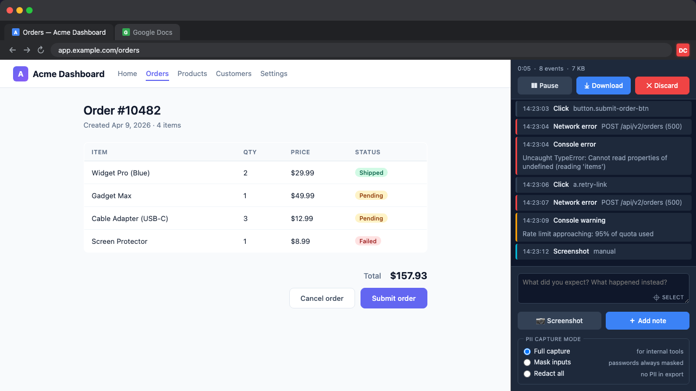
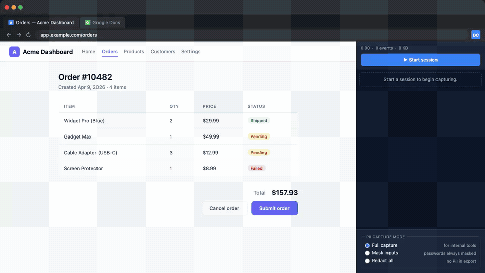

# DeskCheck

A Chrome extension (Manifest V3) that records debugging sessions for AI-assisted bug fixing. Captures user interactions, console errors, network failures, JS exceptions, screenshots, and your own annotations into a single exportable zip file.

<p align="center">
  
</p>

<details>
<summary>See it in action (GIF)</summary>
<p align="center">
  
</p>
</details>

## What it does

When you hit a bug you can't easily reproduce in words, start a DeskCheck session, repro the bug, and stop. You get a zip containing:

- `session.json` — chronological timeline of every click, input, scroll, navigation, console error, network failure, and JS exception
- `screenshots/` — PNGs captured manually or via annotations
- Annotations — your own notes attached to specific moments or DOM elements

The export is designed to be self-contained and easy for an AI assistant (or a colleague) to interpret.

## Install

DeskCheck is not yet on the Chrome Web Store. To install locally:

1. Clone this repo
2. Run `make build`
3. Open `chrome://extensions`, enable **Developer mode**, click **Load unpacked**, and select the `dist/` directory

## Usage

1. Click the DeskCheck icon → **Start Session**
2. Reproduce the bug — the floating widget on the bottom-right shows live metrics (duration, event count, size)
3. Use the widget to take screenshots, select an element, or add a note
4. Click **Stop & Download** to export the session zip

## Develop

```sh
make build       # typecheck + vite build + copy icons
make dev         # vite build --watch
make test        # vitest unit tests
make test-e2e    # Playwright E2E tests (launches Chrome with the extension)
make typecheck   # tsc --noEmit
make clean       # rm -rf dist
```

After `make build`, reload the extension at `chrome://extensions` to pick up changes.

## Architecture

Three components, all vanilla TypeScript (no framework):

- **Service worker** (`src/background/`) — session lifecycle, `chrome.debugger` for console/network capture, screenshots, storage, export
- **Content script** (`src/content/`) — DOM event recording, floating annotation widget (closed Shadow DOM), element picker
- **Popup** (`src/popup/`) — minimal session-start trigger

See [`docs/ARCHITECTURE.md`](docs/ARCHITECTURE.md) for details and [`docs/roadmap.md`](docs/roadmap.md) for planned features.

## CLI handoff (optional)

Instead of stopping and dragging the downloaded zip into an AI assistant's
context, you can attach a local CLI listener so session exports land directly
at a known on-disk path:

```sh
# Terminal 1 — start the listener
node cli/deskcheck.mjs listen --out ./sessions
# prints a ready line:
#   deskcheck listener ready
#     url:   http://127.0.0.1:54329
#     out:   /abs/path/sessions
#     token: <64 hex chars>
#
#   Copy-paste into DeskCheck side panel → Attach CLI listener:
#     http://127.0.0.1:54329 <64 hex chars>
```

Copy the last line, paste it into the DeskCheck side panel's **Attach CLI
listener** row (pre-session only), and record a session as normal. When you
click Stop, the zip POSTs directly to the listener and lands at
`./sessions/<session-id>.zip` — no manual Download step, no drag-into-context.

The handoff is **opt-in** and **local-only**: the listener binds `127.0.0.1`,
requires a per-run bearer token, and the zip never leaves your machine. If
the listener is unreachable at Stop time, DeskCheck falls back to the usual
browser download and shows a warning in the side panel.

### One-command flow (Phase 2)

For a fully automated flow, `deskcheck record` handles everything — listener,
Chrome launch, and session handoff — in a single command:

```sh
make build   # ensure dist/ is up to date
node cli/deskcheck-record.mjs https://app.example.com/buggy-page --out ./sessions
# stderr:
#   deskcheck: listener http://127.0.0.1:54329 ready
#   deskcheck: launched Chrome PID 41523 against https://app.example.com/buggy-page
#   deskcheck:   click the DeskCheck toolbar action when the page loads
#   deskcheck:   then press Start in the side panel and reproduce the bug
```

When Chrome opens, click the DeskCheck toolbar action (a blue "OPEN" badge
appears). The side panel opens with a "Connected to terminal session" badge.
Click Start, reproduce the bug, click Stop. The CLI exits with a JSON summary:

```json
{"session_id":"abc-1234","path":"./sessions/abc-1234.zip","events":42,"screenshots":2,"duration_s":143}
```

Options: `--timeout S` (default 600), `--profile isolated` (fresh Chrome
with extension auto-loaded), `--json` (silent stderr), `--port N`.

**macOS only** for now. Linux/Windows Chrome launch is future work.

## Privacy

DeskCheck is designed for **local use**. The only network traffic DeskCheck
can emit is an opt-in loopback POST to `http://127.0.0.1:<port>` when you
attach a CLI listener (see above). Otherwise all data stays on your machine —
no external network requests are made by the extension. Screenshots can
capture sensitive content visible on screen, and form inputs are recorded
(passwords are masked, sensitive HTTP headers like `Authorization`/`Cookie`
are stripped from network errors). Review your export before sharing it.

## License

[MIT](LICENSE) © Patrick Oladimeji
