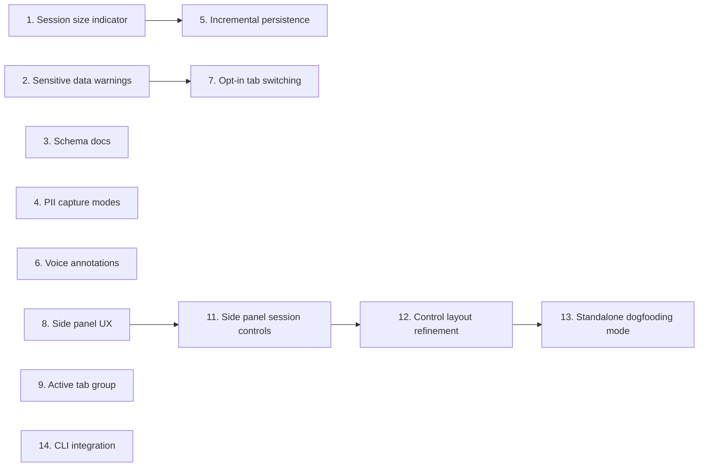

# DeskCheck Roadmap

## Personas

### Bug Reporter
- **Context**: Developer or QA engineer recording debugging sessions on their local machine
- **Primary goal**: Capture enough reproduction context (interactions, errors, screenshots, annotations) to share with teammates or AI assistants, without leaking sensitive data or destabilising the browser
- **Success looks like**: A concise, shareable session export that contains everything needed to reproduce a bug — and nothing that shouldn't leave the machine

### AI Consumer
- **Context**: An AI assistant (or human colleague) receiving and interpreting an exported session zip
- **Primary goal**: Quickly understand the session schema, navigate the timeline, and extract actionable reproduction steps
- **Success looks like**: Can parse `session.json`, understand every event type, and produce a structured bug report or reproduction plan without external documentation

---

## Priority: Now

### 1. Session size and duration indicator
- **Persona**: Bug Reporter
- **Goal**: Prevent silent browser crashes from oversized sessions and give users a sense of how long they've been recording
- **Impact**: High | **Effort**: Small
- **Description**: Show live session metrics in the widget overlay: elapsed duration (e.g., "3m 42s"), event/screenshot counts, and estimated size in MB (e.g., "12 events, 3 screenshots, ~4.2 MB"). Warn the user when the session approaches a dangerous size. Both metrics should remain valuable regardless of persistence backend — they're user-facing measures of the recording, not implementation details of where it's stored.
- **Constraints**: The `unlimitedStorage` permission removes the 10 MB chrome.storage.local quota, but the real ceiling is service worker memory (~512 MB). Each retina screenshot is 2-5 MB as a base64 data URL. The `appendEvent()` read-modify-write cycle and the export path (load all → zip → base64) are the most likely OOM crash points. The size indicator should estimate total in-memory footprint, not just storage quota usage.
- **Definition of done**:
  - [x] Widget displays live elapsed duration since session start (updating every second)
  - [x] Widget displays live count of events and screenshots
  - [x] Widget displays estimated session size in MB
  - [x] Warning appears when estimated size exceeds a configurable threshold (default ~50 MB)
  - [x] Size metric is computed from actual data, not storage quota

### 2. Sensitive data warnings
- **Persona**: Bug Reporter
- **Goal**: Prevent accidental sharing of sensitive information in exports
- **Impact**: High | **Effort**: Small
- **Description**: Show a one-time notice when recording starts explaining that screenshots capture everything visible on screen. Show a reminder before export that the zip may contain sensitive data and is intended for local use only. Include a brief privacy note in the export zip itself.
- **Definition of done**:
  - [x] First-run notice appears when a session starts (dismissible, shown once per install)
  - [x] Pre-export reminder appears in the widget when "Stop & Download" is clicked
  - [x] Export zip includes a `PRIVACY.md` noting that screenshots may contain sensitive data
  - [x] Notice text explains that DeskCheck captures visible screen content, form inputs, and network headers

### 3. Schema documentation for AI consumers
- **Persona**: AI Consumer
- **Goal**: Enable AI assistants to parse and reason about session exports without external docs
- **Impact**: Medium | **Effort**: Small
- **Description**: Include a lightweight `agents.md` file in every exported zip that describes the `session.json` schema — event types, field meanings, timeline structure, and how to interpret screenshots. This makes the export self-documenting.
- **Definition of done**:
  - [x] Every exported zip contains `agents.md` alongside `session.json`
  - [x] `agents.md` describes the schema version, session metadata fields, and each event type with field definitions
  - [x] `agents.md` explains the relationship between timeline entries and `screenshots/` directory
  - [x] An AI assistant given only the zip can produce a structured bug report without additional context (verified manually — see PR description)

### 11. Side panel session controls: lifecycle, feedback, gated UI, reset
- **Persona**: Bug Reporter
- **Goal**: Give the side panel a coherent session-control surface — controls that only appear when they're meaningful, clear async feedback, full lifecycle transitions (pause/resume/stop/discard), auto-scroll that respects user intent, and a clean reset between runs
- **Impact**: High | **Effort**: Medium-Large
- **Description**: Five related pieces of control and polish for the side panel, all landing together since they touch the same form and event-list surface. This feature absorbs the former feature #10 (session lifecycle controls), which has been merged here.

  **1. Gated interaction and lifecycle controls.** The annotation textarea, screenshot button, element-picker trigger, and all lifecycle controls (Pause/Resume/Stop/Discard) are hidden entirely — not disabled — when no session is active. Pre-session, the form shows only the Start button, the PII mode selector, and (if there is residual state) the Reset button. A short "Start a session to begin capturing" empty-state takes the place of the hidden control block so the panel does not look broken. On start, the interaction and lifecycle controls appear. On stop, the form returns to the pre-session state. Hide-not-disable is deliberate: a disabled-looking form pre-session still reads as "this is the main UI" and invites confusion, whereas an empty-state makes the flow unambiguous.

  **2. Loading feedback on async actions.** Save annotation, capture screenshot, and Stop & Download all fire async work without surfacing in-flight state today, which tempts double-clicks. Buttons should enter a loading state (disabled, spinner, or label like "Saving…" / "Capturing…") while their handler runs and return to idle on success or error, with errors remaining visible to the user.

  **3. Auto-scroll the event list to the newest event, respecting user intent.** When a new event is appended and the user is pinned to the bottom, the list auto-scrolls. If the user has scrolled up to inspect earlier events, new appends must not yank them back — a subtle "new events" affordance lets them jump to the bottom manually.

  **4. Session lifecycle controls (Pause / Resume / Stop / Discard).** During an active session, the form exposes four lifecycle controls alongside the interaction controls. **Pause** stops capturing new interactions, console, network, and screenshot events but preserves the existing session and event list. **Resume** re-enables capture without creating a new session or losing the prior timeline. **Stop** finalises the session and triggers export (today's Stop & Download). **Discard** is irreversibly destructive and shows a confirmation dialog naming the concrete data at risk ("Delete N events and M screenshots? This cannot be undone.") that requires explicit confirmation. Pause/Resume transitions are recorded as timeline markers in `session.json` (e.g., `{type: "session_paused", timestamp: ...}`) so gaps are explicit in the export. Session metadata includes a `status` field reflecting `running` / `paused` / `stopped` for export consumers.

  **5. Reset between sessions.** When no session is active and residual state from a prior run remains visible (event list, metrics, lingering metadata), a Reset button clears the panel and returns it to its idle pre-session state. Reset does not require confirmation — the session has already ended and any user-meaningful data was either exported on Stop or dropped on Discard. Reset is hidden entirely when there is nothing to clear or when a session is active; mid-session clearing is **Discard**, not Reset.
- **Dependencies**: Feature #8 (Side panel UX) — all five pieces live in the side panel form and event list. #8 is merged, so this feature is fully unblocked.
- **Definition of done**:
  - **Gated controls (hide, not disable):**
    - [x] Pre-session, the side panel form renders only Start, the PII mode selector, and (conditionally) Reset — the annotation textarea, screenshot button, element-picker trigger, and lifecycle controls are absent from the DOM, not merely disabled
    - [x] Pre-session, a short empty-state ("Start a session to begin capturing" or equivalent) takes the place of the hidden control block so the panel does not look broken
    - [x] On session start, the interaction controls (annotation, screenshot, element picker) and lifecycle controls (Pause, Resume, Stop, Discard) appear
    - [x] On session stop (or after Discard), the form returns to its pre-session state with the interaction and lifecycle controls hidden
  - **Loading feedback:**
    - [x] "Save annotation" shows a loading state (disabled + label/spinner) while the save is in flight
    - [x] "Capture screenshot" shows a loading state while the capture is in flight
    - [x] "Stop & Download" shows a loading state while the export is in flight
    - [x] Loading buttons return to idle on success or error; errors remain visible to the user
  - **Auto-scroll:**
    - [x] Event list auto-scrolls to the bottom when a new event is appended and the user is pinned to the bottom
    - [x] If the user has scrolled up, new appends do not force-scroll — a subtle "new events" indicator lets them jump back manually
  - **Lifecycle controls:**
    - [x] Side panel exposes four lifecycle controls during an active session: Pause, Resume, Stop, Discard
    - [x] Pause stops capturing new interactions, console, network, and screenshot events but preserves the existing session and event list
    - [x] Resume re-enables capture without creating a new session or losing the prior timeline
    - [x] Pause/Resume transitions are recorded as timeline markers in `session.json` (e.g., `{type: "session_paused", timestamp: ...}`) so gaps are explicit
    - [x] Stop behaves as today's "Stop & Download" — finalises the session and triggers export
    - [x] Discard shows a confirmation dialog naming the concrete data at risk ("Delete N events and M screenshots? This cannot be undone.") and requires explicit confirmation
    - [x] After confirmed discard, all events, screenshots, and session metadata for the current session are removed from storage (chrome.storage.local and/or OPFS depending on feature #5 status)
    - [x] Cancelling the discard confirmation leaves the session untouched
    - [x] Session metadata includes a `status` field reflecting `running` / `paused` / `stopped` for consumers of the export
  - **Reset:**
    - [x] A Reset button is rendered in the side panel only when no session is active and residual state (events, metrics, or lingering session metadata) remains to clear
    - [x] Clicking Reset clears the residual state and returns the panel to its idle pre-session state — no confirmation dialog
    - [x] Reset is not rendered while a session is active (mid-session clearing is Discard)
  - **Tests:**
    - [x] Gated visibility, loading state transitions, scroll-anchoring logic, lifecycle state machine (pause/resume), discard storage cleanup, confirmation cancel path, and reset behaviour are unit-tested where possible

### 14. CLI integration: terminal-launched sessions with automatic handoff
- **Persona**: Bug Reporter (primary), AI Consumer (secondary)
- **Goal**: Eliminate the download-and-drop handoff step — let a developer start a DeskCheck session from the terminal (including from a Claude Code session) with a target URL, record against that URL in Chrome, and have the resulting session land directly at a known path the caller can read, without any manual zip download or drag-into-context step
- **Impact**: High | **Effort**: Large
- **Description**: Today the friction of shipping a session to an AI assistant is dominated by the manual handoff: stop & download, find the zip in Downloads, drag it into the assistant's context. This feature closes the loop with a small local process (`deskcheck` CLI) that the caller invokes to start a session. The CLI opens the target URL in Chrome with a session id and auth token embedded in the URL hash fragment, the extension detects the handoff, binds the session to that tab, and records as normal. When the user stops the session, the extension POSTs the export zip to the CLI's local HTTP listener (127.0.0.1 only, per-session token) instead of (or in addition to) triggering a browser download. The CLI stores the session under a known path and exits with a JSON summary on stdout (`{session_id, path, events, screenshots, duration_s}`) so Claude Code (or any shell caller) can parse the result and read the files directly.

  Breaks into two phases that can ship independently:

  **1. Local handoff receiver.** A `deskcheck listen --out DIR` process exposes an HTTP endpoint on 127.0.0.1 that accepts token-authorised session uploads. The extension gains an "export to local listener" code path alongside the existing download: if a listener is reachable and the session carries a matching token, POST the zip; otherwise fall back to the download path. With only phase 1 shipped, the developer runs `deskcheck listen` in one terminal, starts a session in the side panel as normal, and the zip lands under `DIR/<session-id>/` instead of Downloads. Phase 1 alone already removes most of the friction the feature exists to fix.

  **2. Terminal-launched sessions.** A `deskcheck record <url>` command starts the listener, launches Chrome against the target URL with the session marker in the hash fragment (`#_deskcheck=ID:TOKEN:PORT`), and blocks until a matching session arrives or the timeout fires. The extension's content script detects the marker, strips it from the visible URL, and passes the session id/token to the service worker, which opens the side panel bound to that tab and pre-configures the session with the supplied id/token/listener URL. The side panel shows a visible badge naming the connected terminal session so the user knows their interactions are wired to ship somewhere on Stop. Discard cancels the pending handoff cleanly and the CLI returns a "cancelled" response. Chrome launch defaults to the user's existing profile; an optional `--profile isolated` mode spins a dedicated `--user-data-dir` with `--load-extension=dist/` so the flow works on a clean machine.
- **Dependencies**: None strict — independent of other roadmap items. Benefits from feature #5 (incremental OPFS persistence) because larger sessions can flow end-to-end without running into memory limits, and from feature #13 (standalone dogfooding mode) for local development of the listener protocol.
- **Constraints**:
  - **Security by default.** The local HTTP listener must bind 127.0.0.1 only (verified by test). Every session carries a cryptographically random token that must be presented on upload. Tokens are single-use and expire when the session ends or the CLI process exits. Unauthorised uploads are rejected.
  - **Opt-in handoff.** The extension must never POST to a local listener without an explicit session-id marker. Manual sessions started from the side panel continue to download as today with no behaviour change.
  - **Reuse the existing export path.** The listener receives the exact same zip a download would produce, byte-for-byte. Schema version is unchanged — this is a transport change, not a schema change.
  - **Clear user feedback.** The side panel shows a "Connected to terminal session <id>" badge whenever a session is wired to a listener, so Stop does not silently ship data the user did not realise was being handed off.
  - **macOS-first.** Project targets macOS for local development (per CLAUDE.md). The Chrome-launch path is macOS-native for this feature; Linux/Windows are noted as future work in docs.
  - **MCP wrapper deferred, not in scope.** Claude Code already runs shell commands — `deskcheck record <url> --json` plus a `Read` of the returned path is a complete integration with no protocol adapter. A thin MCP server that shells out to the same CLI is a 30-minute follow-up *if* the CLI ergonomics turn out to be insufficient in practice. Explicitly out of scope for this feature so the first version stays simple, testable, and composable with any shell-based agent or CI pipeline.
- **Definition of done**:
  - **Phase 1 — local handoff receiver:**
    - [x] A `deskcheck` CLI ships in the repo (Node `.mjs`, zero runtime deps, stdlib `http`/`fs`/`crypto`/`path` only)
    - [x] `deskcheck listen --out DIR` starts a local HTTP server on 127.0.0.1, prints the bound port and a human-readable ready line, and writes received zips under `DIR/<session-id>.zip`
    - [x] The extension background worker POSTs a finished session zip to a local listener when the `deskcheck_handoff` record is set in `chrome.storage.local`
    - [x] The listener validates the per-session token (Node `timingSafeEqual`) and rejects uploads that do not match with 401
    - [x] The listener is verified to bind 127.0.0.1 only — a non-loopback connect attempt does not reach the server (`cli/deskcheck.test.mjs` D5)
    - [x] Manual (non-CLI) sessions continue to download via the existing path with no behaviour change (`tests/service-worker-handoff.test.ts` D6 — opt-in pin)
    - [x] Integration test: a session POSTs to a test listener and the resulting zip matches a reference download byte-for-byte (`cli/deskcheck.test.mjs` D7)
  - **Phase 2 — terminal-launched sessions:**
    - [ ] `deskcheck record <url> [--timeout S] [--profile existing|isolated] [--json]` starts a listener, launches Chrome against the URL with the session marker in the hash, and blocks until a matching session arrives or the timeout fires
    - [ ] On success the CLI prints a JSON summary to stdout: `{session_id, path, events, screenshots, duration_s}` and exits 0; on timeout or cancellation it exits non-zero with a structured error
    - [ ] The extension content script detects the `#_deskcheck=ID:TOKEN:PORT` marker on page load, strips it from the visible URL, and passes it to the service worker
    - [ ] The service worker opens the side panel bound to that tab and pre-populates the session config with the supplied id, token, and listener URL
    - [ ] The side panel shows a visible "Connected to terminal session <id>" badge whenever a handoff is wired
    - [ ] Pause / Resume / Stop / Discard behave exactly as today; Discard cancels the pending handoff and the CLI receives a cancelled response
    - [ ] `--profile isolated` spins a dedicated `--user-data-dir` with `--load-extension=dist/` so the flow works on a clean machine without a pre-installed extension
    - [ ] macOS-native Chrome launch path works end-to-end; Linux/Windows are noted as future work in docs
  - **Cross-cutting:**
    - [x] Unit tests cover token generation, uniqueness, expiry, and rejection of mismatched tokens (`cli/deskcheck.test.mjs` D8a-c + S17 replay defence via `usedSessions` set)
    - [x] The first-run notice and `PRIVACY.md` are updated to mention CLI handoff and the 127.0.0.1-only guarantee (`src/lib/privacy.test.ts` D9)
    - [x] Export schema (`schema_version`) is unchanged — the listener receives the same zip structure as a download (`src/lib/exporter.golden.test.ts` D10)
    - [x] README includes a short end-to-end walkthrough: `deskcheck listen --out ./sessions` → paste the ready-line into the side panel → record a session → zip lands at the printed path (phase-1 variant; phase-2 cycle will add the `deskcheck record <url>` walkthrough)

---

## Priority: Next

### 4. PII capture modes
- **Persona**: Bug Reporter
- **Goal**: Let users control how much form input data is recorded, based on sensitivity of the site being debugged
- **Impact**: High | **Effort**: Medium
- **Description**: Three input recording modes selectable at session start: **Full** (current behaviour — capture field values, passwords masked), **Metadata** (capture that input occurred, field selector, word count, text length, character class breakdown like emoji/special chars — but not the actual value), **None** (skip input events entirely). Mode is stored in session metadata and noted in the export.
- **Definition of done**:
  - [x] Mode selector appears in popup before session start (Full / Metadata / None)
  - [x] "Full" mode behaves identically to current implementation (passwords masked, values truncated to 200 chars)
  - [x] "Metadata" mode records: element selector, field type, value length, word count, whether value contains digits/emoji/special characters — but never the raw value
  - [x] "None" mode suppresses all input events from the timeline
  - [x] Selected mode is recorded in `session.json` metadata
  - [x] Default mode is "Full" (no behaviour change for existing users)

### 5. Incremental persistence (OPFS)
- **Persona**: Bug Reporter
- **Goal**: Eliminate memory ceiling for long recording sessions
- **Impact**: High | **Effort**: Large
- **Description**: Replace the current chrome.storage.local accumulation model with streaming writes to the Origin Private File System (OPFS). Events are appended to a file as they arrive. Screenshots are written as individual PNGs rather than held as base64 strings in memory. On export, files are zipped directly from OPFS without loading everything into memory. This removes the OOM risk during both recording and export.
- **Dependencies**: Feature #1 (session size indicator) should ship first so users can see the improvement. The indicator's size calculation must be updated to work with OPFS-backed storage.
- **Definition of done**:
  - [x] Events are appended to an OPFS file incrementally, not accumulated in a chrome.storage.local array
  - [x] Screenshots are written as individual PNG files to OPFS, not stored as base64 data URLs
  - [x] Export reads from OPFS and streams into the zip without loading the full session into memory
  - [x] Session recording works for 100+ screenshots and 1000+ events without service worker OOM
  - [x] chrome.storage.local is used only for lightweight session metadata (not events or screenshots)
  - [x] Session metrics from feature #1 (duration, event/screenshot counts, size) continue to work correctly with OPFS-backed storage, with size computed from actual OPFS footprint
  - [x] Existing export schema is preserved (no breaking changes to `session.json`)

### 12. Side panel control layout refinement
- **Persona**: Bug Reporter
- **Goal**: Make the side panel controls more intuitive by separating session lifecycle from annotation, embedding the element picker in the annotation flow, removing the redundant standalone screenshot button, and adding icons to all buttons for scannability
- **Impact**: Medium | **Effort**: Medium
- **Description**: Four related layout changes to the side panel controls:

  **1. Icons on all buttons.** Every button component (Start, Pause/Resume, Stop & Download, Discard, Reset, Add note, Pick element) gets a leading icon so the control surface is scannable at a glance even in the narrow side panel width.

  **2. Remove the standalone screenshot button; replace with a focused-screenshot picker.** A full-page screenshot is already captured automatically with every annotation, so the standalone "Screenshot" button adds little value. Remove it. The element picker becomes the only way to attach a focused (cropped) screenshot to an annotation — it selects a DOM element and crops the full-page capture to that element's bounding box. This simplifies the control surface and clarifies that screenshots are always tied to annotations.

  **3. Move lifecycle controls to the top of the side panel.** Pause/Resume, Stop & Download, and Discard are session-level controls that govern the recording lifecycle. They should be visually separated from the annotation controls and moved to a top toolbar above the event feed. This makes the bottom form purely about composing annotations, and gives the lifecycle controls prominence without cluttering the input area. The Start button (pre-session) and Reset button (post-session) also live in the top bar since they are lifecycle actions.

  **4. Embed the element picker trigger inside the annotation textarea.** The element picker is part of composing an annotation — it attaches a focused screenshot crop to the note. Move the picker trigger inside (or on the border of) the annotation textarea to visually communicate this relationship. The only control outside the textarea is the "Add annotation" button. When an element is picked, the existing chip appears below/inside the textarea showing the selected selector with a clear button.

- **Dependencies**: Feature #11 (Side panel session controls) — this feature reshuffles the controls that #11 introduced. #11 must be complete first.
- **Definition of done**:
  - [x] Every button in the side panel has a leading icon (SVG or Unicode) that communicates its action
  - [x] The standalone "Screenshot" button is removed from the side panel
  - [x] The element picker is the only mechanism for attaching a focused screenshot to an annotation
  - [x] Lifecycle controls (Start, Pause/Resume, Stop & Download, Discard, Reset) are rendered in a top toolbar above the event feed, not in the bottom controls region
  - [x] The bottom controls region contains only: the annotation textarea (with embedded element picker trigger), the selected-element chip, and the "Add annotation" button
  - [x] The element picker trigger is visually embedded inside or on the edge of the annotation textarea
  - [x] PII mode selector remains in the bottom controls (pre-session only, per existing gating logic)
  - [x] Session metrics (duration, counts, size) move to the top bar alongside the lifecycle controls
  - [x] Existing gating logic is preserved: lifecycle controls hidden when no session is active, annotation controls hidden pre-session
  - [x] All existing tests pass; new tests cover the updated DOM structure and control placement

### 13. Standalone dogfooding mode
- **Persona**: Bug Reporter
- **Goal**: Let developers use DeskCheck to record bugs in DeskCheck itself by loading the side panel as a regular webpage that the extension can record against
- **Impact**: Medium | **Effort**: Small-Medium
- **Description**: The side panel HTML currently runs as a `chrome-extension://` page, which the extension cannot attach its debugger to. This feature adds a standalone entry point that mounts the same side panel UI at a normal `http://localhost` URL, with demo/mock implementations of `SidePanelDeps` (the existing DI seam) so the panel renders a representative session state — fake events in the timeline, mock metrics, working controls that log to console instead of messaging the service worker. A `make demo` target starts a local dev server serving this page. The developer then opens the page in a regular Chrome tab and uses the DeskCheck extension to record issues, creating a self-referential feedback loop.
- **Dependencies**: Feature #12 (Control layout refinement) — the standalone mode should reflect the final control layout. #12 is complete.
- **Constraints**:
  - **Reuse, don't copy.** The demo entry point must import and call `mountSidePanel` from `src/sidepanel/sidepanel.ts` — the same function the real extension uses. No forked or duplicated panel code. The only new code is the mock `SidePanelDeps` implementation and the thin entry-point wiring.
  - **Existing tests stay green.** All existing unit and integration tests must continue to pass without modification. The demo mode must not alter any production code paths — if a change to `sidepanel.ts` or its imports is needed to support the mock deps, it must be backward-compatible and covered by the existing test suite.
  - **Mock deps, not mock UI.** The mock `SidePanelDeps` should simulate realistic service-worker behaviour (delayed responses, state transitions) rather than stubbing everything to no-ops, so the demo is useful for spotting real UX issues.
- **Definition of done**:
  - [x] A `demo/` entry point (e.g., `demo/standalone.html` + `demo/standalone-entry.ts`) mounts the side panel via the existing `mountSidePanel` function with mock `SidePanelDeps` — no copied or forked panel code
  - [x] Mock deps supply realistic demo data: a pre-populated event timeline (mix of interaction, console, network, annotation, screenshot events), session metrics, and working PII mode selector
  - [x] Controls that would message the service worker (Start, Pause, Stop, etc.) update local UI state and log to console instead of failing silently
  - [x] `make demo` starts a local dev server (Vite) serving the standalone page at `localhost`
  - [x] The page renders identically to the real side panel — same CSS, same component tree, same layout
  - [ ] DeskCheck extension can attach to and record the standalone page (verified manually)
  - [x] Demo page works without any Chrome extension APIs — no `chrome.*` calls at runtime
  - [x] All existing tests pass without modification — no production code paths are altered by this feature

---

## Priority: Later

### 6. Voice annotations
- **Persona**: Bug Reporter
- **Goal**: Let users describe bugs by speaking instead of typing, reducing friction during recording
- **Impact**: Medium | **Effort**: Medium
- **Description**: Add a microphone button to the widget that records audio and transcribes it to annotation text using the Web Speech API. Fallback: store audio as a file in the export zip if transcription is unavailable. Consider browser support limitations (Web Speech API is Chrome-only and requires network in some implementations).
- **Definition of done**:
  - [ ] Microphone button appears in the widget alongside the annotation textarea
  - [ ] Clicking the button starts listening; spoken text is transcribed into the textarea
  - [ ] User can edit the transcription before submitting
  - [ ] Graceful fallback if Web Speech API is unavailable (button hidden or disabled with tooltip)
  - [ ] No audio is stored or transmitted — only the final text is saved as an annotation

### 7. Opt-in tab switching during a session
- **Persona**: Bug Reporter
- **Goal**: Let users move an active recording to a different tab without stopping and starting a new session, while keeping "which tab is being recorded" fully explicit and user-controlled
- **Impact**: Medium | **Effort**: Medium
- **Description**: A session is currently bound to the tab it started on. `takeScreenshot()` refuses to capture if the recorded tab is not the active tab, which prevents leaking content from an unrelated tab but also means users cannot follow a bug across tabs without ending the session. This feature adds an explicit "Switch recording to this tab" affordance — similar to Chrome's "Share another tab" flow in `getDisplayMedia` — that the user must click to move the recording pointer. Tab changes must be logged to the timeline (new event type or extension to `interaction`) and the export must clearly show which events came from which tab.
- **Constraints**: Must remain opt-in; no implicit follow. Must preserve the privacy invariant "DeskCheck only captures tabs the user explicitly authorised this session". Debugger attach/detach must move with the recording; CDP client currently attaches to a single tab.
- **Definition of done**:
  - [ ] Widget shows a "Switch recording here" button when the user is on a tab that the session is not currently recording
  - [ ] Clicking the button detaches the debugger from the old tab, attaches it to the new tab, and injects the content script if needed
  - [ ] A "tab_switch" timeline event records the from-tab and to-tab URLs and timestamp
  - [ ] `session.json` export includes a per-tab breakdown in the summary
  - [ ] Screenshots taken after a switch capture the new tab, never the old one
  - [ ] First-run notice and pre-export reminder copy are updated to mention that users may opt in to move the recording across tabs

### 8. Side panel UX with live event timeline
- **Persona**: Bug Reporter
- **Goal**: Provide a persistent, always-visible recording surface that shows the full event timeline as it accumulates, instead of a transient popup that loses context on blur
- **Impact**: High | **Effort**: Large
- **Description**: Move the primary DeskCheck UI from the browser action popup into a Chrome side panel (`chrome.sidePanel` API) that fills the full height of the browser window. The panel uses a **bind-on-open** model: from the moment the user clicks the toolbar action the panel is bound to that tab and is visible ONLY there — switching to another tab closes it, returning reopens it. This rule holds whether or not a session is active; the panel's home is decided at open time, not at recording start time. Clicking the action on a different tab rebinds the panel to that tab, except during an active recording session (where the click routes the user back to the recording tab so a second panel is never opened mid-session). This matches the per-tab scoping that `chrome.debugger.attach({ tabId })` already enforces on the capture side. The popup is removed entirely and the start control is moved into the side panel form. Visually modelled on the Claude Chrome extension's side panel: a scrollable event feed in the upper region (chronological list of captured events — DOM interactions, console errors, network failures, annotations, screenshots — each with its timestamp; any event with an associated image renders a small thumbnail inline), and a sticky input/control form pinned to the bottom (start/stop, annotation textarea, screenshot button, session metrics).
- **Definition of done**:
  - [x] Extension registers a side panel via `chrome.sidePanel` and clicking the toolbar action opens the side panel directly (no popup in between)
  - [x] Legacy popup HTML/JS is removed from the build (or reduced to a no-op launcher that immediately opens the side panel)
  - [x] The "Start Session" control lives in the side panel form, not in a popup
  - [x] Side panel fills the full browser height and renders a two-region layout (events above, form below)
  - [x] Upper region shows a live, chronological list of all captured events with per-event timestamp and type label
  - [x] Events that include a screenshot render a small thumbnail inline in the list (placeholder-by-default with click-to-reveal — privacy gate)
  - [x] Event list updates in real time as new events are captured (no manual refresh)
  - [x] Lower region contains the existing controls: start/stop, annotation textarea, screenshot, session metrics from feature #1
  - [x] Event list scrolls independently of the form region; form stays pinned to the bottom
  - [x] Side panel is bound to the tab it is summoned from. The manifest has no `side_panel.default_path` (per [chrome-extensions-samples#987](https://github.com/GoogleChrome/chrome-extensions-samples/issues/987) — a global default silently overrides per-tab scoping), the panel HTML is bundled via `additionalInputs` and declared as a web-accessible resource, and a sync `chrome.action.onClicked` handler fires `setOptions({ tabId, path, enabled: true })` and `sidePanel.open({ tabId })` synchronously within the user-gesture window. Switching tabs hides the panel and returning restores it — verified end-to-end via `e2e/sidepanel-debug.spec.ts` against the sidepanel page's own `document.visibilityState`. `START_SESSION` and `STOP_SESSION` do not touch `setOptions`
  - [x] During an active session, action clicks on a non-recording tab route the user back to the recording tab rather than opening a second panel
  - [x] Per-window scroll position is persisted in `chrome.storage.session` so the feed returns to the same position when the bound tab regains focus
  - [x] Visual styling matches the reference side-panel aesthetic (dark theme, rounded inputs, compact list rows). Legacy in-page widget is removed entirely

### 9. Automatic tab group for active DeskCheck tabs
- **Persona**: Bug Reporter
- **Goal**: Give users immediate visual feedback about which tabs DeskCheck is actively recording, preventing confusion when many tabs are open
- **Impact**: Medium | **Effort**: Small
- **Description**: When a recording session starts on a tab, automatically add that tab to a dedicated "DeskCheck" tab group using the `chrome.tabGroups` API — a distinctive color and label so the user can see at a glance which tabs are under recording. When the session ends (or the tab is closed), remove the tab from the group; clean up the group if it becomes empty. If the group already exists in the current window, reuse it rather than creating a duplicate.
- **Dependencies**: Independent of other roadmap items, but pairs naturally with #8 (side panel) as complementary "active session visibility" cues.
- **Definition of done**:
  - [x] `tabGroups` permission is added to `manifest.json`
  - [x] Starting a session adds the active tab to a "DeskCheck" tab group in the current window
  - [x] Tab group has a distinctive color and a clear label (e.g., "DeskCheck")
  - [x] If a "DeskCheck" group already exists in the window, the tab is added to it rather than creating a new one
  - [x] Ending a session removes the tab from the group
  - [x] If the group becomes empty after a session ends, the group is cleaned up
  - [x] Closing a recorded tab while a session is active does not leave orphaned group state
  - [x] Tab group behaviour is unit/integration-tested where possible (chrome.tabGroups API mocked)

### 10. ~~Session lifecycle controls: pause, resume, stop, discard~~ — merged into #11
- **Status**: Merged into feature #11 (Side panel session controls) on 2026-04-08. All lifecycle controls (Pause / Resume / Stop / Discard) now ship as part of the combined side panel session-controls feature since they share the same form surface and state machine.

---

## Parked

Items that don't serve a core persona goal but might matter later.

| Item | Reason parked | Revisit when |
|------|---------------|--------------|
| Audio file attachments in export | Adds zip size and schema complexity without clear AI consumer benefit | Voice annotations ship and users request raw audio |

---

## Killed

Items cut from scope.

| Item | Reason |
|------|--------|
| (none) | |

---

## Dependencies

- Feature #5 (Incremental persistence) benefits from #1 (Session size indicator) shipping first — users can see the improvement, and the indicator's calculation needs to be compatible with both storage backends.
- Feature #7 (Opt-in tab switching) builds on feature #2 — the "recorded tab only" invariant is the precondition that gives tab switching a clear meaning (moving an explicit pointer rather than implicitly following the user).
- Feature #11 (Side panel session controls: lifecycle, feedback, gated UI, reset) depends on #8 (Side panel UX) — all its pieces live in the side panel form and event list. Absorbs the former feature #10 (session lifecycle controls).
- Feature #12 (Control layout refinement) depends on #11 — it reshuffles the controls that #11 introduced (lifecycle top bar, embedded picker, icon buttons, screenshot removal).
- Feature #13 (Standalone dogfooding mode) depends on #12 — the standalone page should reflect the final control layout. #12 is complete, so #13 is unblocked.
- Features #8 (Side panel UX) and #9 (Active tab group) are complementary "active session visibility" cues but can ship independently.
- Feature #14 (CLI integration) has no strict dependencies. It benefits from #5 (OPFS) once larger sessions can flow end-to-end without memory limits, and from #13 (standalone dogfooding) which gives a convenient local target for iterating on the listener protocol — but neither is a blocker.
- All other features are independent.
