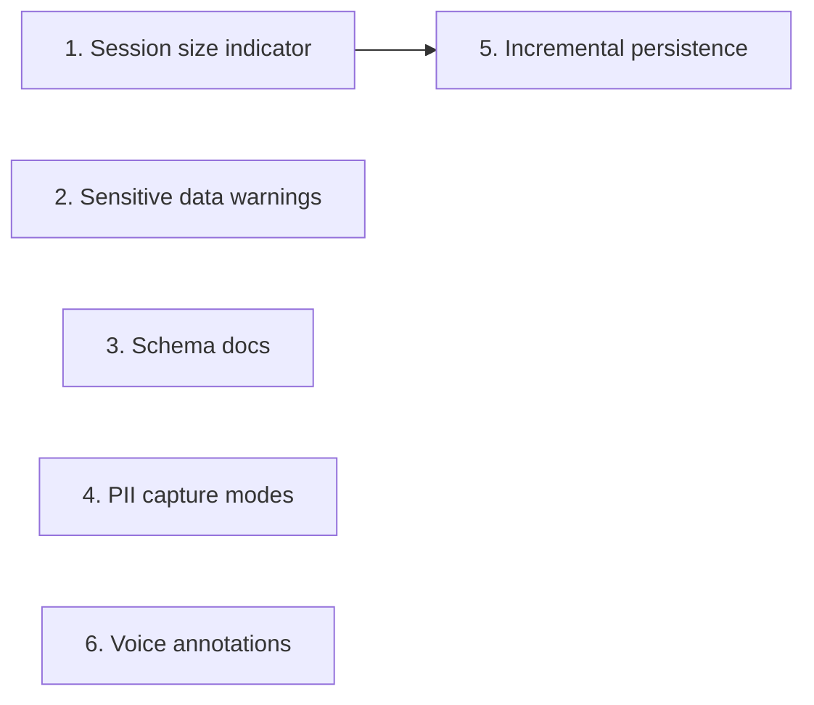

# DeskCheck Roadmap

## Personas

### Bug Reporter
- **Context**: Developer or QA engineer recording debugging sessions on their local machine
- **Primary goal**: Capture enough reproduction context (interactions, errors, screenshots, annotations) to share with teammates or AI assistants, without leaking sensitive data or destabilising the browser
- **Success looks like**: A concise, shareable session export that contains everything needed to reproduce a bug — and nothing that shouldn't leave the machine

### AI Consumer
- **Context**: An AI assistant (or human colleague) receiving and interpreting an exported session zip
- **Primary goal**: Quickly understand the session schema, navigate the timeline, and extract actionable reproduction steps
- **Success looks like**: Can parse `session.json`, understand every event type, and produce a structured bug report or reproduction plan without external documentation

---

## Priority: Now

### 1. Session size indicator
- **Persona**: Bug Reporter
- **Goal**: Prevent silent browser crashes from oversized sessions
- **Impact**: High | **Effort**: Small
- **Description**: Show a live session size estimate in the widget overlay (e.g., "12 events, 3 screenshots, ~4.2 MB"). Warn the user when the session approaches a dangerous size. The indicator should remain valuable regardless of persistence backend — it's a user-facing metric about how large the recording is, not an implementation detail of where it's stored.
- **Constraints**: The `unlimitedStorage` permission removes the 10 MB chrome.storage.local quota, but the real ceiling is service worker memory (~512 MB). Each retina screenshot is 2-5 MB as a base64 data URL. The `appendEvent()` read-modify-write cycle and the export path (load all → zip → base64) are the most likely OOM crash points. The indicator should estimate total in-memory footprint, not just storage quota usage.
- **Definition of done**:
  - [ ] Widget displays live count of events and screenshots
  - [ ] Widget displays estimated session size in MB
  - [ ] Warning appears when estimated size exceeds a configurable threshold (default ~50 MB)
  - [ ] Size metric is computed from actual data, not storage quota
  - [ ] Indicator works correctly after feature #2 (incremental persistence) is implemented — it shows session size, not storage backend details

### 2. Sensitive data warnings
- **Persona**: Bug Reporter
- **Goal**: Prevent accidental sharing of sensitive information in exports
- **Impact**: High | **Effort**: Small
- **Description**: Show a one-time notice when recording starts explaining that screenshots capture everything visible on screen. Show a reminder before export that the zip may contain sensitive data and is intended for local use only. Include a brief privacy note in the export zip itself.
- **Definition of done**:
  - [ ] First-run notice appears when a session starts (dismissible, shown once per install)
  - [ ] Pre-export reminder appears in the widget when "Stop & Download" is clicked
  - [ ] Export zip includes a `PRIVACY.md` noting that screenshots may contain sensitive data
  - [ ] Notice text explains that DeskCheck captures visible screen content, form inputs, and network headers

### 3. Schema documentation for AI consumers
- **Persona**: AI Consumer
- **Goal**: Enable AI assistants to parse and reason about session exports without external docs
- **Impact**: Medium | **Effort**: Small
- **Description**: Include a lightweight `agents.md` file in every exported zip that describes the `session.json` schema — event types, field meanings, timeline structure, and how to interpret screenshots. This makes the export self-documenting.
- **Definition of done**:
  - [ ] Every exported zip contains `agents.md` alongside `session.json`
  - [ ] `agents.md` describes the schema version, session metadata fields, and each event type with field definitions
  - [ ] `agents.md` explains the relationship between timeline entries and `screenshots/` directory
  - [ ] An AI assistant given only the zip can produce a structured bug report without additional context

---

## Priority: Next

### 4. PII capture modes
- **Persona**: Bug Reporter
- **Goal**: Let users control how much form input data is recorded, based on sensitivity of the site being debugged
- **Impact**: High | **Effort**: Medium
- **Description**: Three input recording modes selectable at session start: **Full** (current behaviour — capture field values, passwords masked), **Metadata** (capture that input occurred, field selector, word count, text length, character class breakdown like emoji/special chars — but not the actual value), **None** (skip input events entirely). Mode is stored in session metadata and noted in the export.
- **Definition of done**:
  - [ ] Mode selector appears in popup before session start (Full / Metadata / None)
  - [ ] "Full" mode behaves identically to current implementation (passwords masked, values truncated to 200 chars)
  - [ ] "Metadata" mode records: element selector, field type, value length, word count, whether value contains digits/emoji/special characters — but never the raw value
  - [ ] "None" mode suppresses all input events from the timeline
  - [ ] Selected mode is recorded in `session.json` metadata
  - [ ] Default mode is "Full" (no behaviour change for existing users)

### 5. Incremental persistence (OPFS)
- **Persona**: Bug Reporter
- **Goal**: Eliminate memory ceiling for long recording sessions
- **Impact**: High | **Effort**: Large
- **Description**: Replace the current chrome.storage.local accumulation model with streaming writes to the Origin Private File System (OPFS). Events are appended to a file as they arrive. Screenshots are written as individual PNGs rather than held as base64 strings in memory. On export, files are zipped directly from OPFS without loading everything into memory. This removes the OOM risk during both recording and export.
- **Dependencies**: Feature #1 (session size indicator) should ship first so users can see the improvement. The indicator's size calculation must be updated to work with OPFS-backed storage.
- **Definition of done**:
  - [ ] Events are appended to an OPFS file incrementally, not accumulated in a chrome.storage.local array
  - [ ] Screenshots are written as individual PNG files to OPFS, not stored as base64 data URLs
  - [ ] Export reads from OPFS and streams into the zip without loading the full session into memory
  - [ ] Session recording works for 100+ screenshots and 1000+ events without service worker OOM
  - [ ] chrome.storage.local is used only for lightweight session metadata (not events or screenshots)
  - [ ] Session size indicator (#1) reports correct size from OPFS-backed storage
  - [ ] Existing export schema is preserved (no breaking changes to `session.json`)

---

## Priority: Later

### 6. Voice annotations
- **Persona**: Bug Reporter
- **Goal**: Let users describe bugs by speaking instead of typing, reducing friction during recording
- **Impact**: Medium | **Effort**: Medium
- **Description**: Add a microphone button to the widget that records audio and transcribes it to annotation text using the Web Speech API. Fallback: store audio as a file in the export zip if transcription is unavailable. Consider browser support limitations (Web Speech API is Chrome-only and requires network in some implementations).
- **Definition of done**:
  - [ ] Microphone button appears in the widget alongside the annotation textarea
  - [ ] Clicking the button starts listening; spoken text is transcribed into the textarea
  - [ ] User can edit the transcription before submitting
  - [ ] Graceful fallback if Web Speech API is unavailable (button hidden or disabled with tooltip)
  - [ ] No audio is stored or transmitted — only the final text is saved as an annotation

---

## Parked

Items that don't serve a core persona goal but might matter later.

| Item | Reason parked | Revisit when |
|------|---------------|--------------|
| Audio file attachments in export | Adds zip size and schema complexity without clear AI consumer benefit | Voice annotations ship and users request raw audio |

---

## Killed

Items cut from scope.

| Item | Reason |
|------|--------|
| (none) | |

---

## Dependencies

- Feature #5 (Incremental persistence) benefits from #1 (Session size indicator) shipping first — users can see the improvement, and the indicator's calculation needs to be compatible with both storage backends.
- All other features are independent.
