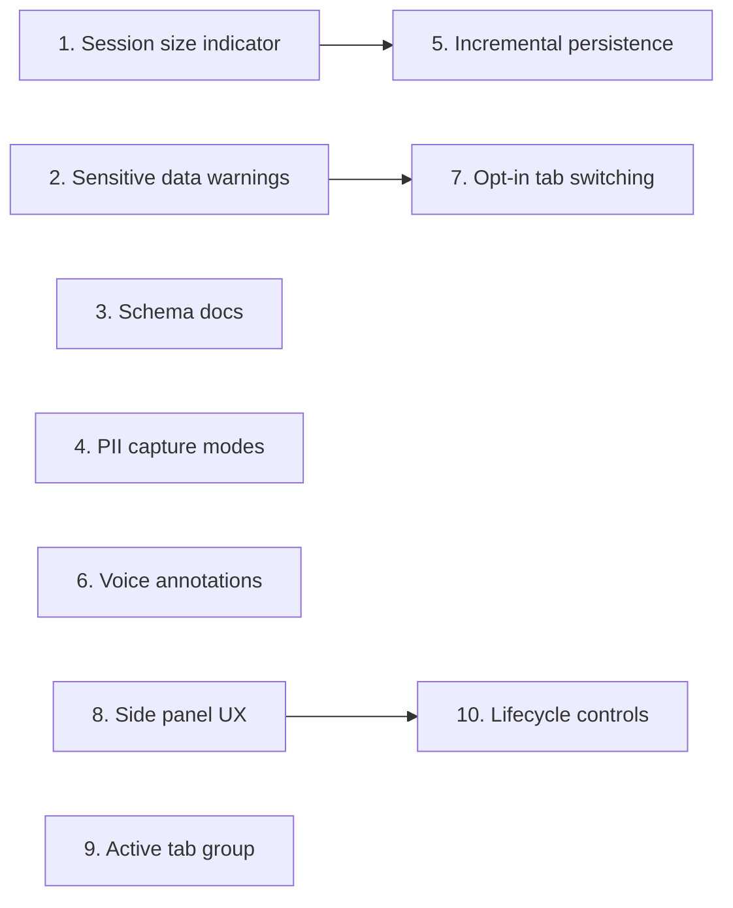

# DeskCheck Roadmap

## Personas

### Bug Reporter
- **Context**: Developer or QA engineer recording debugging sessions on their local machine
- **Primary goal**: Capture enough reproduction context (interactions, errors, screenshots, annotations) to share with teammates or AI assistants, without leaking sensitive data or destabilising the browser
- **Success looks like**: A concise, shareable session export that contains everything needed to reproduce a bug — and nothing that shouldn't leave the machine

### AI Consumer
- **Context**: An AI assistant (or human colleague) receiving and interpreting an exported session zip
- **Primary goal**: Quickly understand the session schema, navigate the timeline, and extract actionable reproduction steps
- **Success looks like**: Can parse `session.json`, understand every event type, and produce a structured bug report or reproduction plan without external documentation

---

## Priority: Now

### 1. Session size and duration indicator
- **Persona**: Bug Reporter
- **Goal**: Prevent silent browser crashes from oversized sessions and give users a sense of how long they've been recording
- **Impact**: High | **Effort**: Small
- **Description**: Show live session metrics in the widget overlay: elapsed duration (e.g., "3m 42s"), event/screenshot counts, and estimated size in MB (e.g., "12 events, 3 screenshots, ~4.2 MB"). Warn the user when the session approaches a dangerous size. Both metrics should remain valuable regardless of persistence backend — they're user-facing measures of the recording, not implementation details of where it's stored.
- **Constraints**: The `unlimitedStorage` permission removes the 10 MB chrome.storage.local quota, but the real ceiling is service worker memory (~512 MB). Each retina screenshot is 2-5 MB as a base64 data URL. The `appendEvent()` read-modify-write cycle and the export path (load all → zip → base64) are the most likely OOM crash points. The size indicator should estimate total in-memory footprint, not just storage quota usage.
- **Definition of done**:
  - [x] Widget displays live elapsed duration since session start (updating every second)
  - [x] Widget displays live count of events and screenshots
  - [x] Widget displays estimated session size in MB
  - [x] Warning appears when estimated size exceeds a configurable threshold (default ~50 MB)
  - [x] Size metric is computed from actual data, not storage quota

### 2. Sensitive data warnings
- **Persona**: Bug Reporter
- **Goal**: Prevent accidental sharing of sensitive information in exports
- **Impact**: High | **Effort**: Small
- **Description**: Show a one-time notice when recording starts explaining that screenshots capture everything visible on screen. Show a reminder before export that the zip may contain sensitive data and is intended for local use only. Include a brief privacy note in the export zip itself.
- **Definition of done**:
  - [x] First-run notice appears when a session starts (dismissible, shown once per install)
  - [x] Pre-export reminder appears in the widget when "Stop & Download" is clicked
  - [x] Export zip includes a `PRIVACY.md` noting that screenshots may contain sensitive data
  - [x] Notice text explains that DeskCheck captures visible screen content, form inputs, and network headers

### 3. Schema documentation for AI consumers
- **Persona**: AI Consumer
- **Goal**: Enable AI assistants to parse and reason about session exports without external docs
- **Impact**: Medium | **Effort**: Small
- **Description**: Include a lightweight `agents.md` file in every exported zip that describes the `session.json` schema — event types, field meanings, timeline structure, and how to interpret screenshots. This makes the export self-documenting.
- **Definition of done**:
  - [x] Every exported zip contains `agents.md` alongside `session.json`
  - [x] `agents.md` describes the schema version, session metadata fields, and each event type with field definitions
  - [x] `agents.md` explains the relationship between timeline entries and `screenshots/` directory
  - [x] An AI assistant given only the zip can produce a structured bug report without additional context (verified manually — see PR description)

---

## Priority: Next

### 4. PII capture modes
- **Persona**: Bug Reporter
- **Goal**: Let users control how much form input data is recorded, based on sensitivity of the site being debugged
- **Impact**: High | **Effort**: Medium
- **Description**: Three input recording modes selectable at session start: **Full** (current behaviour — capture field values, passwords masked), **Metadata** (capture that input occurred, field selector, word count, text length, character class breakdown like emoji/special chars — but not the actual value), **None** (skip input events entirely). Mode is stored in session metadata and noted in the export.
- **Definition of done**:
  - [x] Mode selector appears in popup before session start (Full / Metadata / None)
  - [x] "Full" mode behaves identically to current implementation (passwords masked, values truncated to 200 chars)
  - [x] "Metadata" mode records: element selector, field type, value length, word count, whether value contains digits/emoji/special characters — but never the raw value
  - [x] "None" mode suppresses all input events from the timeline
  - [x] Selected mode is recorded in `session.json` metadata
  - [x] Default mode is "Full" (no behaviour change for existing users)

### 5. Incremental persistence (OPFS)
- **Persona**: Bug Reporter
- **Goal**: Eliminate memory ceiling for long recording sessions
- **Impact**: High | **Effort**: Large
- **Description**: Replace the current chrome.storage.local accumulation model with streaming writes to the Origin Private File System (OPFS). Events are appended to a file as they arrive. Screenshots are written as individual PNGs rather than held as base64 strings in memory. On export, files are zipped directly from OPFS without loading everything into memory. This removes the OOM risk during both recording and export.
- **Dependencies**: Feature #1 (session size indicator) should ship first so users can see the improvement. The indicator's size calculation must be updated to work with OPFS-backed storage.
- **Definition of done**:
  - [ ] Events are appended to an OPFS file incrementally, not accumulated in a chrome.storage.local array
  - [ ] Screenshots are written as individual PNG files to OPFS, not stored as base64 data URLs
  - [ ] Export reads from OPFS and streams into the zip without loading the full session into memory
  - [ ] Session recording works for 100+ screenshots and 1000+ events without service worker OOM
  - [ ] chrome.storage.local is used only for lightweight session metadata (not events or screenshots)
  - [ ] Session metrics from feature #1 (duration, event/screenshot counts, size) continue to work correctly with OPFS-backed storage, with size computed from actual OPFS footprint
  - [ ] Existing export schema is preserved (no breaking changes to `session.json`)

---

## Priority: Later

### 6. Voice annotations
- **Persona**: Bug Reporter
- **Goal**: Let users describe bugs by speaking instead of typing, reducing friction during recording
- **Impact**: Medium | **Effort**: Medium
- **Description**: Add a microphone button to the widget that records audio and transcribes it to annotation text using the Web Speech API. Fallback: store audio as a file in the export zip if transcription is unavailable. Consider browser support limitations (Web Speech API is Chrome-only and requires network in some implementations).
- **Definition of done**:
  - [ ] Microphone button appears in the widget alongside the annotation textarea
  - [ ] Clicking the button starts listening; spoken text is transcribed into the textarea
  - [ ] User can edit the transcription before submitting
  - [ ] Graceful fallback if Web Speech API is unavailable (button hidden or disabled with tooltip)
  - [ ] No audio is stored or transmitted — only the final text is saved as an annotation

### 7. Opt-in tab switching during a session
- **Persona**: Bug Reporter
- **Goal**: Let users move an active recording to a different tab without stopping and starting a new session, while keeping "which tab is being recorded" fully explicit and user-controlled
- **Impact**: Medium | **Effort**: Medium
- **Description**: A session is currently bound to the tab it started on. `takeScreenshot()` refuses to capture if the recorded tab is not the active tab, which prevents leaking content from an unrelated tab but also means users cannot follow a bug across tabs without ending the session. This feature adds an explicit "Switch recording to this tab" affordance — similar to Chrome's "Share another tab" flow in `getDisplayMedia` — that the user must click to move the recording pointer. Tab changes must be logged to the timeline (new event type or extension to `interaction`) and the export must clearly show which events came from which tab.
- **Constraints**: Must remain opt-in; no implicit follow. Must preserve the privacy invariant "DeskCheck only captures tabs the user explicitly authorised this session". Debugger attach/detach must move with the recording; CDP client currently attaches to a single tab.
- **Definition of done**:
  - [ ] Widget shows a "Switch recording here" button when the user is on a tab that the session is not currently recording
  - [ ] Clicking the button detaches the debugger from the old tab, attaches it to the new tab, and injects the content script if needed
  - [ ] A "tab_switch" timeline event records the from-tab and to-tab URLs and timestamp
  - [ ] `session.json` export includes a per-tab breakdown in the summary
  - [ ] Screenshots taken after a switch capture the new tab, never the old one
  - [ ] First-run notice and pre-export reminder copy are updated to mention that users may opt in to move the recording across tabs

### 8. Side panel UX with live event timeline
- **Persona**: Bug Reporter
- **Goal**: Provide a persistent, always-visible recording surface that shows the full event timeline as it accumulates, instead of a transient popup that loses context on blur
- **Impact**: High | **Effort**: Large
- **Description**: Move the primary DeskCheck UI from the browser action popup into a Chrome side panel (`chrome.sidePanel` API) that fills the full height of the browser window. Clicking the toolbar icon opens the side panel directly — the current popup (with its redundant "Start Session" button) is removed entirely, and the start control is moved into the side panel form. Visually modelled on the Claude Chrome extension's side panel: a scrollable event feed in the upper region, a sticky input/control form pinned to the bottom. The upper region shows a chronological list of captured events — DOM interactions, console errors, network failures, annotations, and screenshots — each with its timestamp. Any event that has an associated image (screenshots, annotation attachments) renders a small thumbnail inline. The lower region contains the existing session form (start/stop, annotation textarea, screenshot button, session metrics). The side panel persists across tab switches within the same window so recording state and the event list remain visible.
- **Definition of done**:
  - [ ] Extension registers a side panel via `chrome.sidePanel` and clicking the toolbar action opens the side panel directly (no popup in between)
  - [ ] Legacy popup HTML/JS is removed from the build (or reduced to a no-op launcher that immediately opens the side panel)
  - [ ] The "Start Session" control lives in the side panel form, not in a popup
  - [ ] Side panel fills the full browser height and renders a two-region layout (events above, form below)
  - [ ] Upper region shows a live, chronological list of all captured events with per-event timestamp and type label
  - [ ] Events that include a screenshot render a small thumbnail inline in the list
  - [ ] Event list updates in real time as new events are captured (no manual refresh)
  - [ ] Lower region contains the existing controls: start/stop, annotation textarea, screenshot, session metrics from feature #1
  - [ ] Event list scrolls independently of the form region; form stays pinned to the bottom
  - [ ] Side panel state (open/closed, scroll position) persists across tab switches within the same window
  - [ ] Visual styling is consistent with the existing widget theme and matches the reference side-panel aesthetic (dark theme, rounded input, compact list rows)

### 9. Automatic tab group for active DeskCheck tabs
- **Persona**: Bug Reporter
- **Goal**: Give users immediate visual feedback about which tabs DeskCheck is actively recording, preventing confusion when many tabs are open
- **Impact**: Medium | **Effort**: Small
- **Description**: When a recording session starts on a tab, automatically add that tab to a dedicated "DeskCheck" tab group using the `chrome.tabGroups` API — a distinctive color and label so the user can see at a glance which tabs are under recording. When the session ends (or the tab is closed), remove the tab from the group; clean up the group if it becomes empty. If the group already exists in the current window, reuse it rather than creating a duplicate.
- **Dependencies**: Independent of other roadmap items, but pairs naturally with #8 (side panel) as complementary "active session visibility" cues.
- **Definition of done**:
  - [ ] `tabGroups` permission is added to `manifest.json`
  - [ ] Starting a session adds the active tab to a "DeskCheck" tab group in the current window
  - [ ] Tab group has a distinctive color and a clear label (e.g., "DeskCheck")
  - [ ] If a "DeskCheck" group already exists in the window, the tab is added to it rather than creating a new one
  - [ ] Ending a session removes the tab from the group
  - [ ] If the group becomes empty after a session ends, the group is cleaned up
  - [ ] Closing a recorded tab while a session is active does not leave orphaned group state
  - [ ] Tab group behaviour is unit/integration-tested where possible (chrome.tabGroups API mocked)

### 10. Session lifecycle controls: pause, resume, stop, discard
- **Persona**: Bug Reporter
- **Goal**: Give users full control over an in-progress recording — pause to skip irrelevant activity, resume when ready, stop to finalise, or discard entirely if they want to start over without exporting junk data
- **Impact**: High | **Effort**: Medium
- **Description**: Add lifecycle controls to the side panel form: **Pause** (stop capturing new events but keep the existing session intact and visible), **Resume** (re-attach capture without losing the prior timeline), **Stop** (finalise the session — same as today's "Stop & Download"), and **Discard** (delete all events, screenshots, and session metadata for the current session and return the UI to its pre-session state). Discard must be destructive and irreversible, so it must show a confirmation prompt that clearly states "this will permanently delete N events and M screenshots" before proceeding. Pause/Resume should also be reflected in the event list (e.g., a visible "paused at 12:34:56" marker) so the user can see continuity gaps. Session state (`running` / `paused` / `stopped`) is recorded in session metadata so paused regions are unambiguous in the export.
- **Dependencies**: Feature #8 (Side panel UX) — the new controls live in the side panel form, and Discard needs the event list to show what is about to be deleted. Must ship after #8.
- **Definition of done**:
  - [ ] Side panel form exposes four controls during an active session: Pause, Resume, Stop, Discard
  - [ ] Pause stops capturing new interactions, console, network, and screenshot events but preserves the existing session and event list
  - [ ] Resume re-enables capture without creating a new session or losing the prior timeline
  - [ ] Pause/Resume transitions are recorded as timeline markers in `session.json` (e.g., `{type: "session_paused", timestamp: ...}`) so gaps are explicit
  - [ ] Stop behaves as today's "Stop & Download" — finalises the session and triggers export
  - [ ] Discard shows a confirmation dialog that names the concrete data at risk ("Delete N events and M screenshots? This cannot be undone.") and requires explicit confirmation
  - [ ] After confirmed discard, all events, screenshots, and session metadata for that session are removed from storage (chrome.storage.local and/or OPFS depending on feature #5 status)
  - [ ] After discard, the side panel returns to its idle/pre-session state and a new session can be started immediately
  - [ ] Cancelling the discard confirmation leaves the session untouched
  - [ ] Session metadata includes a `status` field reflecting `running` / `paused` / `stopped` for consumers of the export
  - [ ] Lifecycle transitions are unit-tested (pause/resume state machine, discard storage cleanup, confirmation cancel path)

---

## Parked

Items that don't serve a core persona goal but might matter later.

| Item | Reason parked | Revisit when |
|------|---------------|--------------|
| Audio file attachments in export | Adds zip size and schema complexity without clear AI consumer benefit | Voice annotations ship and users request raw audio |

---

## Killed

Items cut from scope.

| Item | Reason |
|------|--------|
| (none) | |

---

## Dependencies

- Feature #5 (Incremental persistence) benefits from #1 (Session size indicator) shipping first — users can see the improvement, and the indicator's calculation needs to be compatible with both storage backends.
- Feature #7 (Opt-in tab switching) builds on feature #2 — the "recorded tab only" invariant is the precondition that gives tab switching a clear meaning (moving an explicit pointer rather than implicitly following the user).
- Feature #10 (Lifecycle controls) depends on #8 (Side panel UX) — the pause/resume/stop/discard controls live in the side panel form and the discard confirmation needs the event list to describe what will be deleted.
- Features #8 (Side panel UX) and #9 (Active tab group) are complementary "active session visibility" cues but can ship independently.
- All other features are independent.
